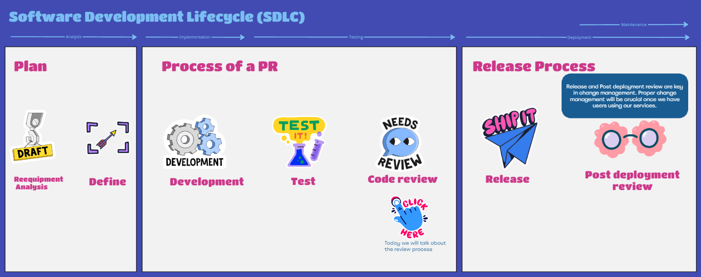

# Why Code Reviews Are Important

- **Enhance collective ownership**: Move accountability from the individual to the team.
- **Improve common understanding of the code**
- **Create a feedback loop**
- **Encourage best practices**
- **Improve code quality**

# How to Author a Pull Request

1. **Link the PR with the corresponding Jira ticket** by naming the branch after the DPQUAL-XXXX code of the story. The easiest way to do this is to click the “Create a branch“ button inside the story.
2. **Create small PRs** - split the Jira story into subtasks if it makes sense.
3. **Avoid empty PR messages**. Include:
   - **Why**: Explains the motivation and context behind the PR, providing the rationale for the changes.
   - **What**: Summarizes the key changes made, outlining the scope and main modifications.
   - **How**: Provide some details on how the feature can be tested.
   - You can use some of the info defined in the Jira ticket or use Copilot to generate a useful PR message.
4. **Test your own code** before it is being sent to someone else to review. If it’s a runnable application, it might make sense to run it locally and manually test a few functionalities as a sanity check, since tests don’t always catch these errors immediately.
5. **Post new PRs to DCI chat**
   - You can tag the person if you have a specific reviewer in mind.
6. **Mark the story as “Ready for review” in Jira** and assign it to the person who is going to review it.
7. **As soon as the reviewer is done with the feedback**, it can be assigned back to the author to validate and implement the feedback.
8. **React to and implement suggested changes if it makes sense.**

# How to Review a Pull Request

1. **Follow the [5 steps](https://blog.shimin.io/are-code-reviews-crippling-your-delivery-process-how-categorizing-your-code-review-comments-can-speed-things-up) of clarifications hierarchy**:
   - **Clarifications**: This is often a sanity check for the reviewer (i.e. “I don’t have a full context of the problem, so I’m not sure if I understand this correctly”) that might catch a gap in the implementation.
   - **Nitpicks**: Non-blocking suggestions on stylistic improvements or spelling. Try to explicitly mark these comments as “NIT:”.
   - **Suggestions**: An alternative implementation of functionality that can spark tradeoff discussions.
   - **Infringement**: Anything that goes against the feature specification or best practices defined by the team. Try to link the source document or a past experience detailing why it’s not a good idea to do this.
   - **Stop the line**: Indicates that an additional guardrail should be implemented in the team. The resulting decisions should be made by the whole team.
2. **It is your responsibility and not the code owner’s** to resolve comments on the PR if this is not done automatically by future commits (using the Resolve button on Github).
3. **Guide and help the author who is asking for help/review**.
4. **Provide good justification, code examples, and reduce ambiguity as much as possible**.
5. **Unless you know a better solution to implement new features, don't block the author**. If you know it is not best practice, you can flag it and create a Jira ticket to improve technical debt. However, as long as the code works, it should not block or delay the release.
6. **Address nitpicking comments (tech debt)**:
   - Raise it to the parking lot; create suggestions for improvements, and create tasks if needed.
7. **Check for the following**:
   - **Correctness**: Ensuring the code does what it is supposed to do.
   - **Security**: Identifying and mitigating potential security vulnerabilities.
   - **Readability**: Making sure the code is easy to understand and maintain.
   - **Consistency**: Ensuring adherence to coding standards and practices, naming standards.
   - **Test Coverage**: Verifying that the code is adequately tested.

# Discussions in Progress

- What categories of comments (i.e. nitpicks, suggestions, etc.) do we want to have in our team?
