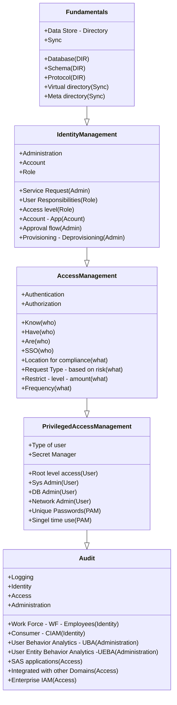

# Identity & Access Management

Identity Management and Identity Governance are critical components of modern IT infrastructure. They ensure that the right individuals have access to the right resources at the right times for the right reasons. This document provides an overview of the key aspects of Identity Management, including Administration, Authentication, Authorization, and Audit.

## High-Level Overview

### Administration
Administration involves the creation (provision), management, and deletion (deprovision) of user accounts and identities within an organization. It ensures that user identities are accurately maintained and updated as needed.

### Authentication
Authentication is the process of verifying the identity of a user. This can include various methods such as passwords, biometric scans, and security tokens to ensure that the user is who they claim to be.

### Authorization
Authorization determines what an authenticated user is allowed to do. It involves setting permissions and access levels to ensure that users only have access to the resources necessary for their roles.

### Audit
Audit involves tracking and recording user activities and access to resources. This helps in ensuring compliance with policies and regulations, as well as identifying and responding to suspicious activities.

---

# Fundamentals
Identity Management / Identity Governance Fundamentals

## Data Store

### Enterprise Directory
- An Enterprise Directory refers to a single source of truth containing information about employees and organizational structures.
- **Active Directory (AD)**
  - The Microsoft version of the data store.
- **Microsoft Entra Domain Services**
    - An example of an enterprise directory solution that integrates with other domains and provides directory services.

### Directory (DIR)
- A database of accounts (identity and role).
- **Schema**
  - Organizes the data about a user.
- **Protocol**
  - A way to communicate with the directory. A well-known protocol is the Lightweight Directory Access Protocol (LDAP).

### Ideal Scenario
- In a perfect scenario, all data would be stored in an Enterprise Directory.
- However, this is often not possible because different applications have varying requirements and may need separate data stores.
- These applications typically have hooks that connect to these distinct data stores.

## Sync Data Stores - Integrated Directories 
There are two primary ways to synchronize data stores:
1. **Virtual Directory (VD)**
   - Acts as an index that points to another location from where data can be retrieved.
   - Information might be cached for performance.

2. **Meta Directory**
   - Prefetches the data and stores it in an Enterprise Directory.
   - Only relevant pieces of information might be stored, not all data.
  

# Identity Management / Identity Governance

## Use Cases

### New Hire Process
1. **Account 1**: Request to the Identity Management System for a new account.
2. **IT Role**: Assign roles based on the new hire's business responsibilities.

### Employee Offboarding
- **Deprovisioning**: Deleting accounts when an employee leaves.
- **Automated Approval**: Ensuring all access is revoked upon employee departure.

### Existing User Access
- **Need More Access**: Handling requests from existing users who need additional access.

## Administration

#### Account Management
- **Manual Approval**: Some accounts may require manual approval, for example, when you request to purchase something or access sensitive data.
 
#### Roles and Responsibilities
- Assigning roles and responsibilities based on the user’s business role.
- Using tools like ServiceNow, Hubble, and Baseplate for managing roles and responsibilities.

#### Provisioning and Deprovisioning
- **Accounts**: Creating and deleting user accounts.
- **Approval Workflow**: Managing the process of approving access requests.
  - **Access Requests (Access Req)**: Requests for access to specific applications or resources.
  - **Applications (APPs)**: Software applications that users need access to.
  - **Automatic Approval Process**: Automatically approving access requests if the user is active in the HR system.
