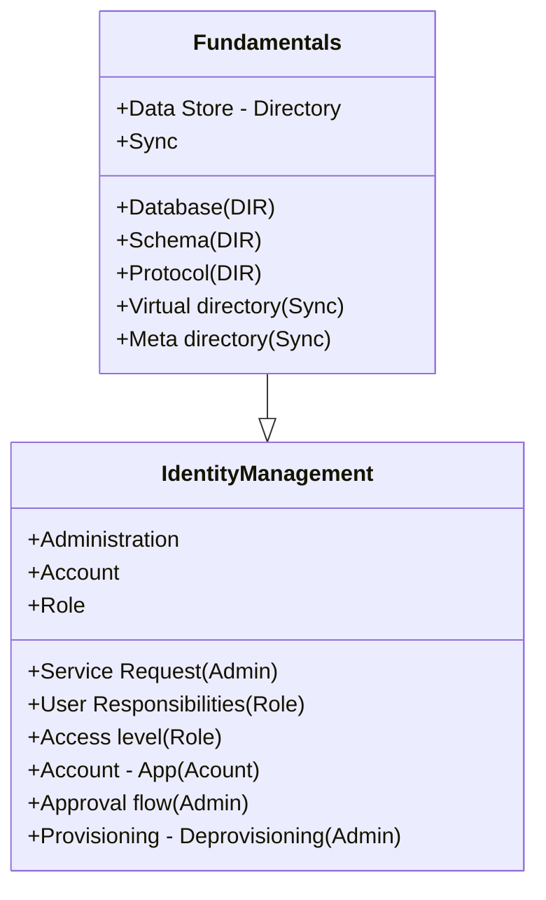

# High level
- **Administration**
- **Authentication**
- **Authorization**
- **Audit**

# Base - Fundamentals
Identity Management / Identity Governance Fundamentals

## Data Store

### Enterprise Directory
- An Enterprise Directory refers to a single source of truth containing information about employees and organizational structures.
- **Active Directory (AD)**
  - The Microsoft version of the data store.
- **Microsoft Entra Domain Services**
    - An example of an enterprise directory solution that integrates with other domains and provides directory services.

### Directory (DIR)
- A database of accounts (identity and role).
- **Schema**
  - Organizes the data about a user.
- **Protocol**
  - A way to communicate with the directory. A well-known protocol is the Lightweight Directory Access Protocol (LDAP).

### Ideal Scenario
- In a perfect scenario, all data would be stored in an Enterprise Directory.
- However, this is often not possible because different applications have varying requirements and may need separate data stores.
- These applications typically have hooks that connect to these distinct data stores.

## Sync Data Stores - Integrated Directories 
There are two primary ways to synchronize data stores:
1. **Virtual Directory (VD)**
   - Acts as an index that points to another location from where data can be retrieved.
   - Information might be cached for performance.

2. **Meta Directory**
   - Prefetches the data and stores it in an Enterprise Directory.
   - Only relevant pieces of information might be stored, not all data.
   
