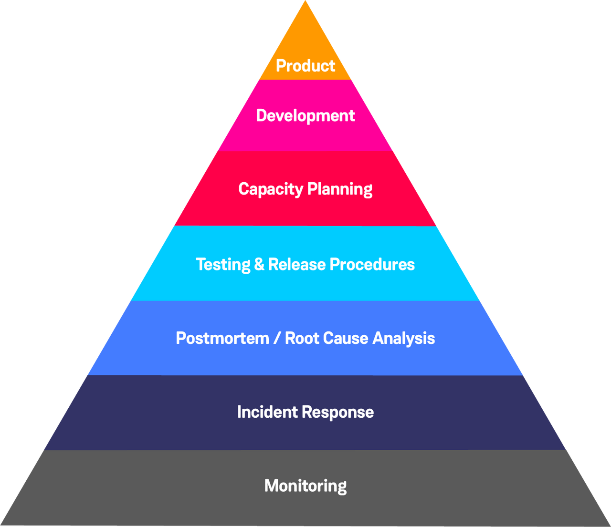

## Related Roles and Transferable Skills in SRE SRE

The SRE book describes other closely related roles that are similar to the role of an SRE, and highlights the importance of having transferable skills or switching between roles (hats) to achieve the best outcome for the project.

### 1. Sysadmin (System Administrator)
- **Primary Focus:** Keep systems (servers, networks, OS) running smoothly.
- **Key Activities:**
  - Configuring **production** systems
  - Modifying configurations (Load balancing, Server)
  - Documenting self-service documentation
  - Setup, update, patching
  - Tuning of OS parameters
  - Consulting on architecture and design for developer teams
  - 🖥️ Linux commands: Heavy day-to-day usage for managing systems
  - 🔧 Debugging skills: At the OS and infrastructure level (disks, memory, network issues)
  - ⚙️ Operations: Routine maintenance, patching, account management
  - 📊 Monitoring: Traditional system-level monitoring (CPU, disk, RAM)
  - Understanding application code
  - Cost optimization
  - Philosophy: Reactive, system-centric, less tied to software development

---

### 2. DevOps Engineer
- **Primary Focus:** Bridge between development and operations, emphasizing speed and collaboration.
- **Key Activities:**
  - 🛠️ Engineering practices and tools: CI/CD pipelines, container orchestration, IaC (Infrastructure as Code)
  - 📦 Automation vs human effort: Shift left, automate deployments, testing, scaling
  - 💰 Cost optimization: Design infrastructure efficiently (cloud cost awareness, scaling policies)
  - 🔄 Change management: Enable frequent, reliable releases
  - Improving documentation
  - Manual or repetitive task reduction
  - Philosophy: “You build it, you run it” → integrate ops with dev for faster iteration

---

### 3. Operations
- **Key Activities:**
  - Eliminate toil (reduce manual or repetitive tasks)
        > People have a limit on how much toil they can tolerate; too much toil can decrease work morale.
  - Incident management (Post-mortems)
  - Improving documentation
  - Automation vs human effort

---

### 4. Software Engineering
- **Key Activities:**
  - Writing or modifying code
  - Design and documentation documents
  - Writing authentication scripts
  - Creating tools or frameworks, bootstrap/modules
  - Adding service features
  - Modifying infrastructure code

---

### 5. Site Reliability Engineer (SRE)
- **Primary Focus:** Reliability, scalability, and efficiency of services in production.
- **Key Activities:**
  - 🛡️ Availability of services: Measured via SLAs, SLOs, SLIs
  - 📉 Error budget (depleted): Decides trade-offs between reliability and feature velocity
  - 🔄 Incident management (Post-mortems): Root cause analysis, blameless post-mortems
  - ⚡ Emergency response / run-books: Structured response to outages
  - 🧹 Eliminate toil: Reduce repetitive manual work via automation
  - 📊 Efficiency: Scale teams and services without linear cost growth
  - 👨‍💻 Understanding application code: Can dive into source code to debug production issues
  - 🔗 SRE as part of dev teams: They code, review, and design alongside developers to prevent skill erosion
  - Monitoring: Both white box (📄 logs, 📊 metrics) and black box (🕵️‍♂️ UI testing)
  - Engineering practices and tools
  - Change management
  - Philosophy: Engineering approach to ops → reliability is a feature, managed with data and code

---

### Overhead
- **Administrator work not tied to running a service:**
  - Hiring, HR paperwork
  - Team or company meetings
  - Bug hygiene
  - Pair reviews
  - Self-assessment
  - Training courses

---